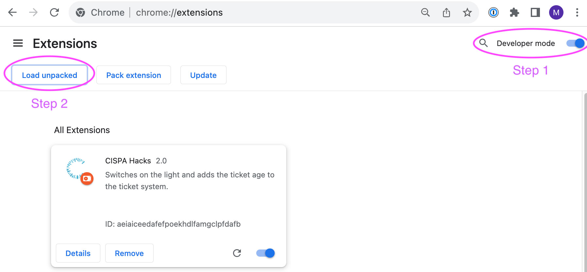

# CISPA Website Hacks

A Chrome extension that increases quality of life on [cispa.de](https://cispa.de/en).

## Features
- Turns on the light on the main website
- Adds the ticket age to the ticket system

## Installation
1. Visit [chrome://extensions](chrome://extensions)
2. Enable Developer Mode
3. Click "Load unpacked", select the "src" folder

    

## Version History
- 2.1: 2024-12-16 Fixed date parsing bug in ticket system
- 2.0: 2023-11-15 Fixed lightmode, added ticket age
- 1.0: 2023-10-02 Added lightmode

## License
The source code in this repository is licensed under the **MIT license**. Refer to [docs/LICENSE](docs/LICENSE) for more information.

## Contact
My contact details can be found on my personal [website](https://maximiliangolla.com).
